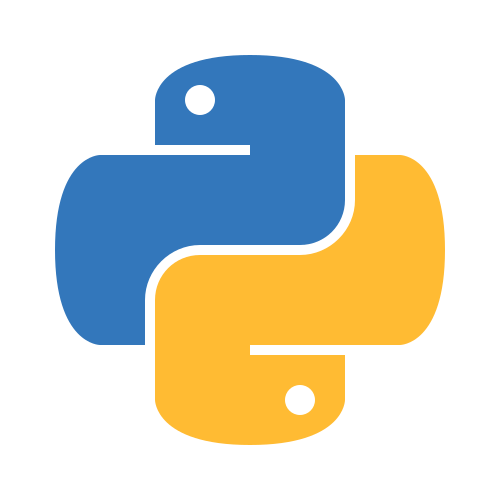

# Intro to Coding (getting started with Python 3)

    Anthony Truelove MASc, P.Eng.
    github: gears1763-2

## 0 - Introduction

--------

## Welcome!

Welcome to Intro to Coding (getting started with Python 3).  

Like the name suggests, this course is aimed at getting you started with Python 3; an
open-source, high level, and general purpose programming language that is one of the
most popular in the world!  

Before diving in, we should first talk about what this course aims to achieve and how 
it intends to do so.

--------

## Learning a New Language

When you initially decided to participate in this course, you may have thought of it as
more of a STEM (Science, Technology, Engineering, and Mathematics) course. While it is
certainly true that programming does live largely within the domain of STEM, that's 
actually not the driving philosophy adopted in this course. Instead, it is designed and
delivered more like a second language course (like learning French, or Spanish, or
Mandarin). Indeed, they're called programming *languages* for a good reason!  

To illustrate this point, let us consider two people: one from France, and another
from Hungary. If these two people wish to speak to one another, then there are three
possible solutions

  1. The French person can speak Hungarian; or
  
  2. The Hungarian person can speak French; or
  
  3. Both people can speak some intermediary (or bridge) language (English, for example).

If you've ever travelled to (or are lucky enough to live in) Europe, then you will
probably have experienced solution 3 most commonly.  

This illustration is relevant to this course because computer programming is, at its
core, an exercise in solution 3. The goal of programming of course is to issue a set
of instructions to a computer in order to complete a given task. This then implies 
communication between the computer and the programmer. However, a computer only
"understands" machine language (`1011000101001...`), whereas a programmer (probably) only
understands a natural (i.e. human) language. These two languages (like French and
Hungarian) are *very* different from one another; so much so that each party learning
the other language is largely a lost cause.  

Enter high level programming languages, like Python. Python serves as the intermediary 
language between the computer and the programmer by providing a language that is human 
readable (and thus intelligible to the programmer) and yet constrained enough to be
interpreted by a computer (and thus is intelligible to the machine).

**The goal of this course is to begin developing a basic fluency in Python 3**

--------

## Immersion and the Pareto Principle

When learning a new language natively (think being born into it), there are two dynamics
in play

  1. Immersion; and
  
  2. The Pareto Principle

Immersion has to do with what one might expect; one is simply born into the language and 
is exposed to it every day. There is no other language, and so one not only learns to 
comprehend and express in that language, but they also learn to *think* in that
language (which is considered by many to be a key indicator of fluency). **This course 
is immersive in that it is focused on learning by doing** rather than learning by way of 
a formal treatment of the underlying theory, language structure, rules and grammar, etc. 
Such a formal treatment is no doubt important (especially for developing a more advanced 
fluency in Python), but for the beginner it is probably more overwhelming than 
instructive. Indeed, one does not begin teaching their children their language by
inundating them with conjugation tables; they learn by just ... talking.  

Learning a new language natively also tends to unveil the so-called Pareto Principle. 
This principle simply states that 80% of an outcome tends to arise from only 20% of the
causes (and *vice versa*). In the context of language, this translates roughly to
"80% of fluency tends to arise from a comprehension of only 20% of the language". If
you consider your own native language, ask yourself "how much of the language do I
actually use on a daily basis?"; the answer is probably "about 20%". This is important
because it indicates that a roughly 80% fluency in a given language can be achieved by
identifying and focussing on learning the "core" 20% that is used over and over again by
native speakers. **This course exploits the Pareto Principle by focussing on the "core"
of Python, which is taken to be the Python Standard Library**.
