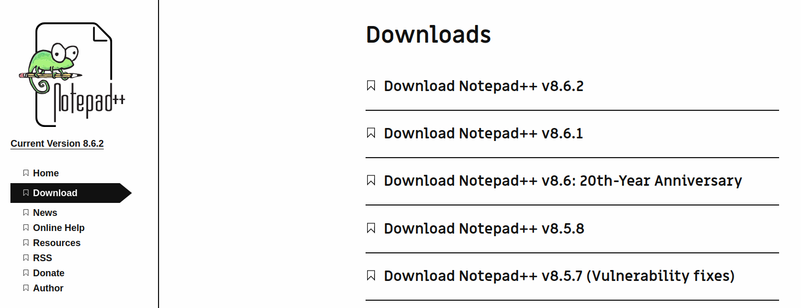
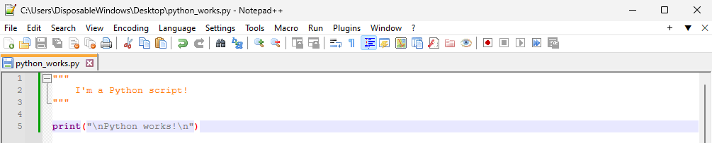

# Intro to Coding (getting started with Python 3)

    Anthony Truelove MASc, P.Eng.
    github: gears1763-2

## 1.2 - Installing an Editor

--------

## Editor vs IDE

It is important for this course that you use a simple editor as opposed to a full 
integrated development environment (IDE), such as PyCharm, Visual Studio, Code::Blocks, 
etc. When first learning a new programming language, it is arguably best to learn
without the aid of an IDE. This serves both immersion and the Pareto Principle.  

Immersion is served because there is only the programming language without any of the
natural language "hand holding" that is presented by the interface of an IDE. This helps 
one to learn the programming language more naturally, rather than relying on their own 
natural language as a crutch.  

The Pareto Principle is served because a simple editor does not present one with a 
myriad of options, settings, etc. like an IDE does (the vast majority of which are
meaningless to the beginner). This then allows the student to focus on the core 20% 
with minimal distraction.

--------

## Windows Solution

For Windows users, a good general-purpose editor is Notepad++ (which is freely available 
from <https://notepad-plus-plus.org/downloads/>). As of the date of this course, the 
latest version of Notepad++ is 8.6.2.

Download and execute the installer (file name like `npp.8.6.2.Installer.x64.exe`). Once 
installed, open a new Notepad++ file and enter the following

    """
        I'm a Python script!
    """
    
    print("\nPython works!\n")

Then, save the file with a `.py` extension. Once you do that, you should see that 
Notepad++ supports Python syntax highlighting (which colour codes the various parts of 
the script; this is massively helpful in terms of readability!).

--------

## Linux Solution

For Linux users, you could just use something built-in like `gedit` (which does support 
Python syntax highlighting). However, another good solution is Geany (which should be 
available on most package managers; see <https://www.geany.org/>).  

For Debian/Ubuntu users, you can install Geany by way of

    $  sudo apt-get install geany

(Yes, Geany is *technically* an IDE, but it is pretty lightweight and it looks and feels 
like essentially an editor. It's certainly no more or less complicated interface-wise 
than Notepad++, and so it shouldn't get in the way of either immersion or the Pareto 
Principle.)
