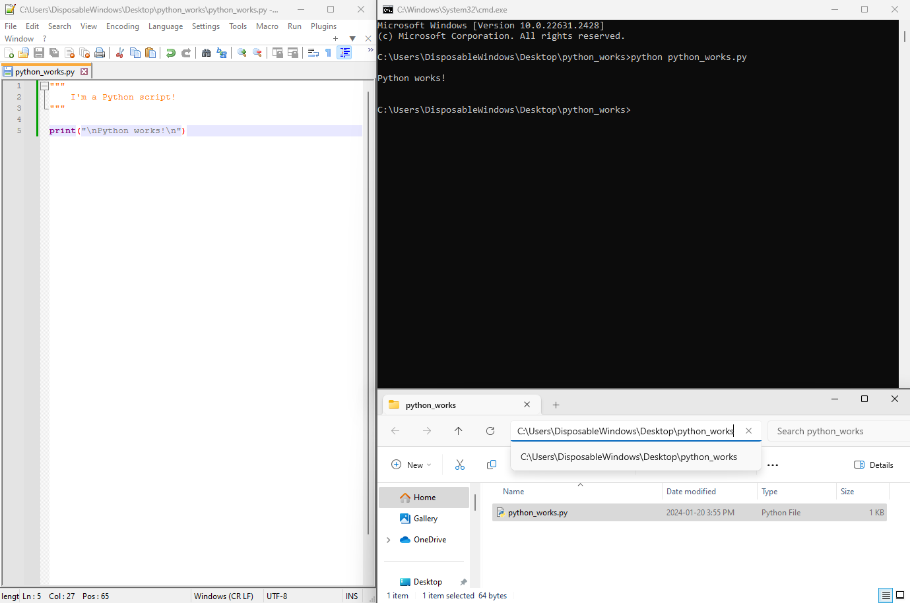

# Intro to Coding (getting started with Python 3)

    Anthony Truelove MASc, P.Eng.
    github: gears1763-2

## 1.3 - Intended Workflow

--------

Throughout this course, you will notice that we use the same workflow over and over 
again; namely

  1. Write a Python script (or scripts) using an editor.
  
  2. Open a command prompt (Windows) or terminal (Linux) instance in the working
     directory of the script(s).
  
  3. Invoke the Python intepreter from the command prompt / terminal to exectute the
     script(s).

That's it, that's all; simple (and you can actually do *a lot* with this simple
workflow!).  

For Windows users, this workflow might be illustrated as below

For Linux users, the workflow will look essentially identical (so from now on, only the 
Windows examples will be illustrated).
