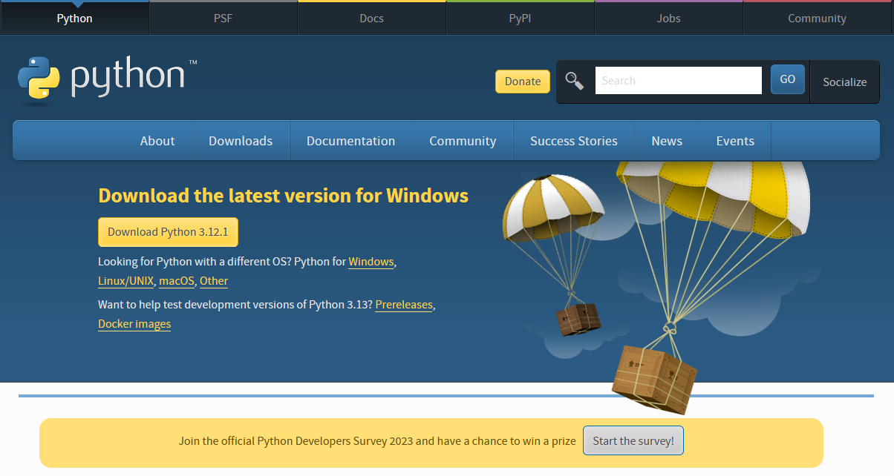
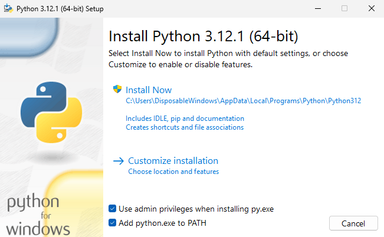
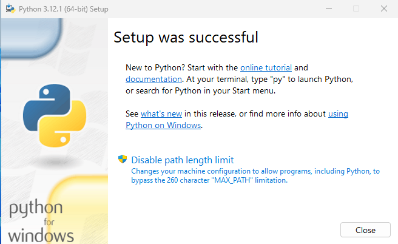
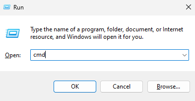
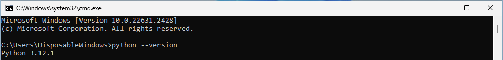
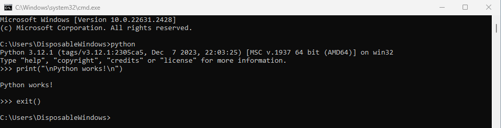

# Intro to Coding (getting started with Python 3)

    Anthony Truelove MASc, P.Eng.
    github: gears1763-2

## 1.1 - Installing a Python Interpreter

--------

## Windows Installation

In order to use Python on Windows, you will probably need to first install a Python 
interpreter. The easiest way to do so is to download an installer from
<https://www.python.org/downloads/>. For this course, the focus is on Python 3, so 
any version 3.X should work fine. However, more recent is better, so this installation 
step-by-step will be for Python 3.12.1 (the latest version available as of the date of
this course).

To download the installer for the intepreter, click on the `Download Python 3.12.1`
button at <https://www.python.org/downloads/>.

Once you have the installer file downloaded (should be something like
`python-3.12.1-amd64.exe`), execute it and you should be greeted with the installer 
setup window. **Be sure to select both `Use admin privileges` and
`Add python.exe to PATH`**, as illustrated below. Once those selections have been made,
click on `Install Now` to begin the installation process.

Once the installation process has completed, you should be presented with a `Setup was 
successful` window.  In that window, click on `Disable path length limit` and select 
`Yes`. Once that's done, you can close the installer.

And that's it!

To test your installation of the Python interpreter, you can launch a command prompt by
way of [Windows Key] + [R] (or Start Menu --> Run), then enter `cmd`, then click `OK`.

From the command prompt, invoke

    >python --version

If you then receive version info, such as

    Python 3.12.1

you are set up and ready to go.

## Minimal Working Example

Try invoking `python` from the command prompt. Then issue

    >>> print("\nPython works!\n")

followed by

    >>> exit()

Can you guess what's happening here?

--------

## Linux Installation

For those of you who are using Linux, thank you =P.  

For most popular Linux distributions, Python comes pre-installed (which means you're 
probably already set up!). To test this out, you can invoke

    $  python --version

or

    $  python3 --version

If you get output that looks something like

    Python 3.XX.XX

then you already have a Python interpreter installed. If not, then there should be 
Python packages available for your distribution. Refer to the package manager 
documentation for your chosen distro.
