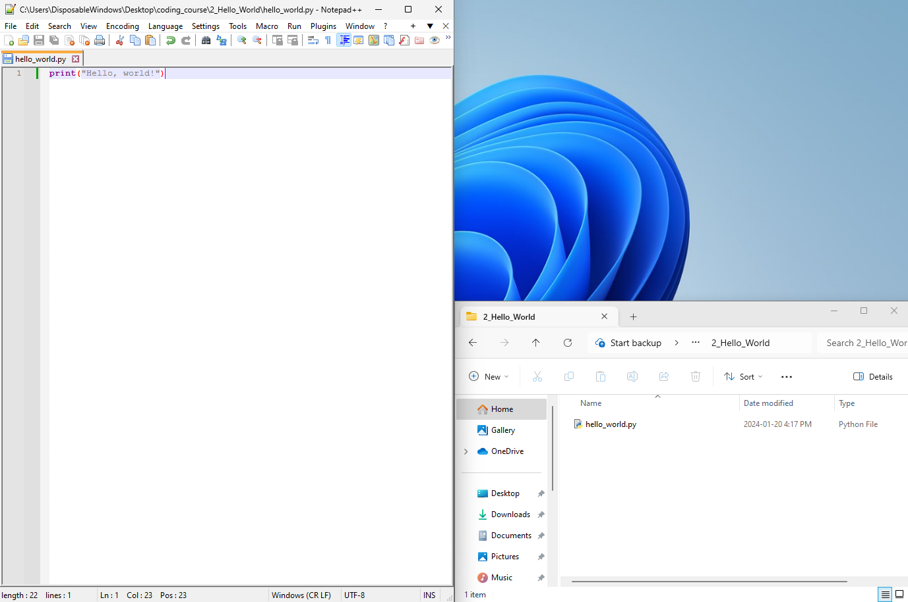
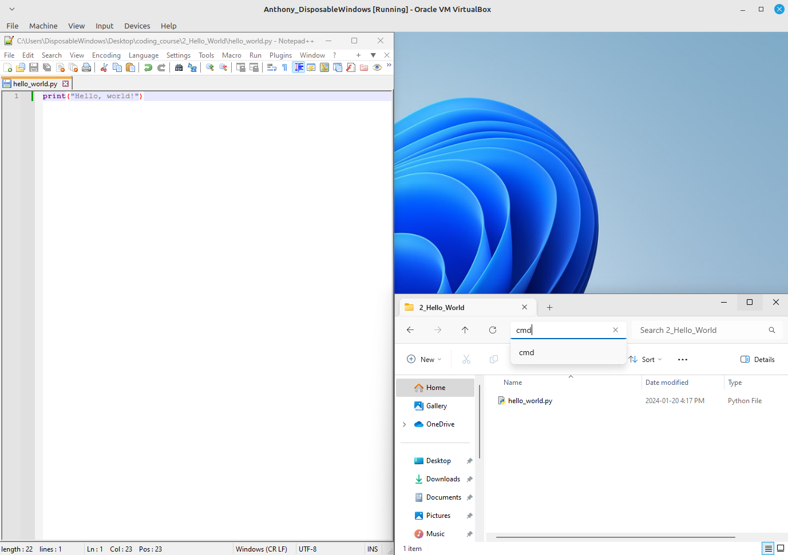
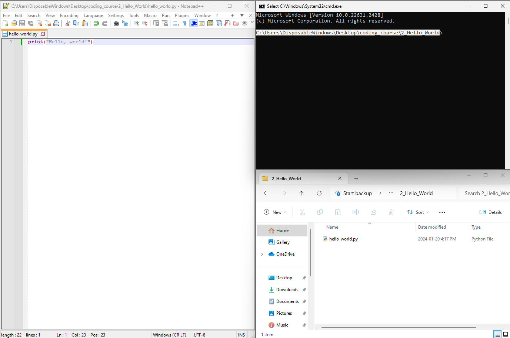
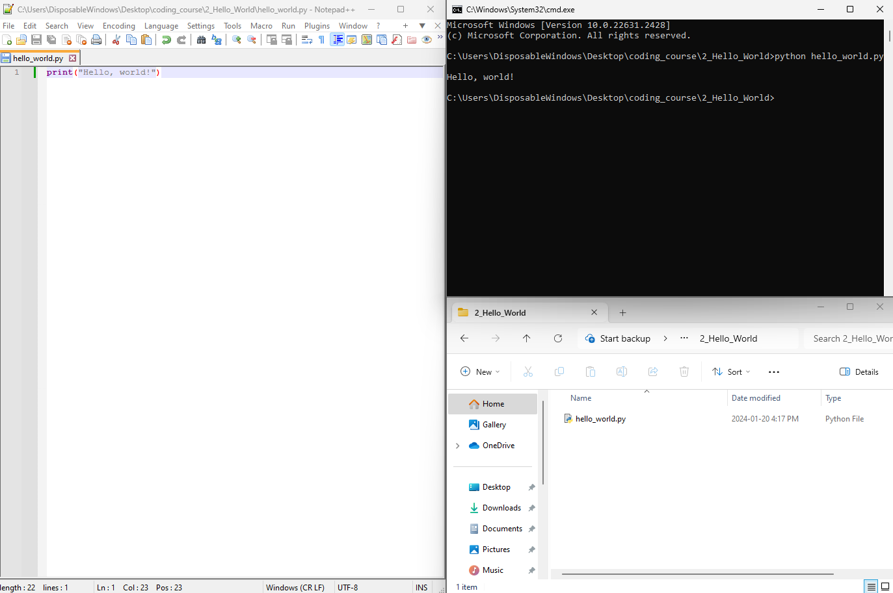

# Intro to Coding (getting started with Python 3)

    Anthony Truelove MASc, P.Eng.
    github: gears1763-2

## 2.1 - Hello World

--------

## Creating and Executing the Script

As is tradition when learning a new programming language, the first task we will tackle 
is the classical Hello World. That is, we simply want the computer to print out the 
statement "Hello, world!".  

To begin, create a folder on your desktop (you can call it whatever you want). Be sure 
to have the folder open to follow along.  

Next, open your editor, create a new file, and save it to your folder using the filename 
`hello_world.py`. Although this file is currently empty, it should exist in your folder 
(and you should be able to see it)

Now, for this very simple example, it suffices to do the following in your editor

  1. Invoke the `print()` function passing it the string `"Hello, world!"`.
  
  2. Save the file.

Next, we need to open a command prompt / terminal instance *in the folder* (this is
important, or the Python interpreter won't know where to find your script(s)!). To do 
so on Windows, you can use your file explorer a bit like a web browser. Click in the 
address bar of the file explorer, then type `cmd` and press [Enter].  

Once you press [Enter], you should see the command prompt open. Take note that, in the 
command prompt, the text before the `>` symbol should be the path to the folder that you 
created (highlighted in the image below). In general, this text always defines the
current working directory of the command prompt instance (it tells you where the
command prompt is "currently looking").

Finally, to execute your script, invoke

    >python hello_world.py

in the command prompt. In general, invoking a Python script from the command prompt
(usually) always follows the same general calling sequence; namely

    >python (SCRIPT NAME).py

Once you execute the script, you should see your computer print the prescribed message 
to the command prompt.

And ... that's it! Congratulations; you've created and executed your first Python
script.  =)

--------

## Consolidation

From this quick lesson, you should have picked up the following bits of knowledge  

  * How to create a new Python script (`.py` file extension) using an editor.
  
  * How to print text (i.e. a string) using the Python `print()` function.
  
  * How to open a command prompt in a given working directory.
  
  * How to execute a Python script from the command prompt (this is invoking the Python 
    interpreter).
