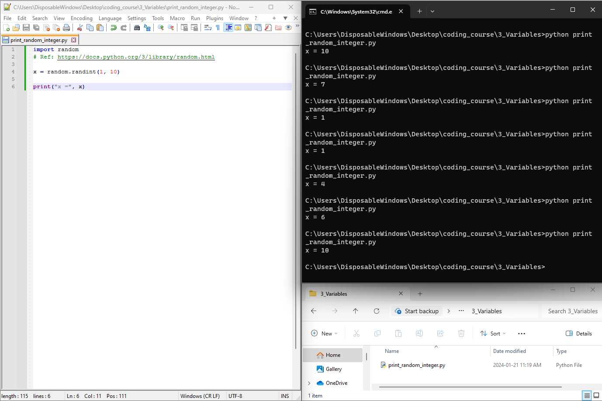

# Intro to Coding (getting started with Python 3)

    Anthony Truelove MASc, P.Eng.
    github: gears1763-2

## 3.1 - Variables

--------

## Motivation

The Hello World script that we played with previously demonstrated a few important bits
of knowledge (namely creating and executing a script). However, it is ultimately a very 
static example (it just prints "Hello, world!" and that's it; not very interesting, or 
useful).  

In order to get our scripts to behave more dynamically, there are a few bits of 
pre-requisite knowledge that we need to gain before we're really in a position to start 
experimenting. That said, the first thing that one should probably learn about is the
idea of variables in computer programming.  

--------

## Variables: what are they?

Variables in computer programming are essentially the same idea as variables in 
mathematics. That is, **a variable is just a named container for a particular value**.
For example, in mathematics one might say

    x = 2

which communicates that there is a variable called `x` and it currently contains the 
value `2`. If one then says "move `2x` units of distance to the right", that communicates
that, in this case, the intent is moving `2 * x = 2 * (2) = 4` units of distance to the 
right. If the value of `x` is changed, then the corresponding movement intent changes
accordingly.  

### Minimal Working Example

Let's try a minimal working example (MWE) in which we declare a variable called `x` and
initialize it to some random integer between 1 and 10. Once that's done, we'll print the
value of `x` to the command prompt.  

This MWE can be achieved by way of the following

    import random
    # Ref: https://docs.python.org/3/library/random.html
    
    x = random.randint(1, 10)
    
    print("x =", x)

Once you create and execute this script a number of times, you should get output similar
to the following:

**Hint**: You can use the [Up Arrow] and [Down Arrow] keys in the command prompt to 
page through that instance's command history. This will save you from having to retype 
the same command over and over again (which can get tedious fast).

There are a few lines in this MWE script that warrant explanation (and unveil some 
valuable knowledge).

  1. `import random`: This line imports the `random` module of the Python Standard
     Library (the Standard Library is considered here to be the "core" 20% of the Python
     language). This is done because the Standard Library is *BIG* (see
     <https://docs.python.org/3/library/index.html>, if you dare!) and so by default it 
     is not loaded in its entirety. However, for this example we need random number 
     generation, and so we import that particular part of the Standard Library.
  
  2. `# Ref: ...`: This line is a single-line comment (starts with a `#`), and so it is
     ignored by the Python interpreter. Now, while this is useless in terms of execution, 
     good use of comments nontheless becomes quite important as scripts become large.
     Consider writing a script, putting it down for several months, and then picking it
     back up again. Chances are, you will not remember what exactly you were doing or
     why. Comments give us a way of writing reminders for ourselves (or others!) of what
     the script is doing (like putting Post-It notes on your monitor, or fridge, etc.).
     In this particular case, the comment is just a reference to the online
     documentation for the `random` module (which was found by just Googling
     "Python random").
  
  3. `x = random.randint(1, 10)`: This line creates a variable called `x` and then
     initializes it with a random integer between 1 and 10. This line also shows an 
     exmaple of accessing a function (namely `randint()`) of the `random` module; one 
     uses dot notation, much like the URL for a website. 
  
  4. `print("x =", x)`: This is just the `print()` function that we've seen a few times 
     now, but with a slightly different calling sequence. Notice that you can pass in a 
     sequence of parameters, in this case the string `"x ="` and then the integer `x`. 
     The resulting print is what you might expect.

--------

## Consolidation

From this quick lesson, you should have picked up the following bits of knowledge:  

  * How to import a module of the Python Standard Library.
  
  * How to write a single-line comment.
  
  * How to declare a variable and initialize it with a value.
  
  * How to print a sequence of strings and variables.
